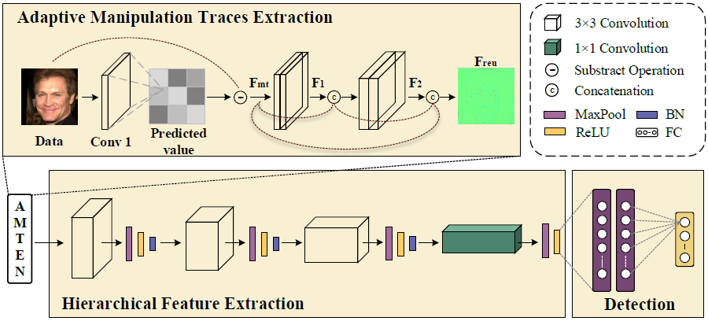

# Fake face detection via adaptive manipulation traces extraction network

Zhiqing Guo<sup>1</sup>, 
Gaobo Yang<sup>1</sup>,
Jiyou Chen<sup>1</sup>,
and Xingming Sun<sup>2</sup></br>
<sup>1</sup> Hunan University, China; 
<sup>2</sup> Nanjing University of Information Science and Technology, China</br>




## AMTENnet -- This is an official Caffe implementation.
With the proliferation of face image manipulation (FIM) techniques such as Face2Face and Deepfake, more fake face images are spreading over the internet, which brings serious challenges to public confidence. Face image forgery detection has made considerable progresses in exposing specific FIM, but it is still in scarcity of a robust fake face detector to expose face image forgeries under complex scenarios such as with further compression, blurring, scaling, etc. Due to the relatively fixed structure, convolutional neural network (CNN) tends to learn image content representations. However, CNN should learn subtle manipulation traces for image forensics tasks. Thus, we propose
an adaptive manipulation traces extraction network (AMTEN), which serves as pre-processing to suppress image content and highlight manipulation traces. AMTEN exploits an adaptive convolution layer to predict manipulation traces in the image, which are reused in subsequent layers to maximize manipulation artifacts by updating weights during the back-propagation pass. A fake face detector, namely AMTENnet, is constructed by integrating AMTEN with CNN. Experimental results prove that the proposed AMTEN achieves desirable pre-processing. When detecting fake face images generated by various FIM techniques, AMTENnet achieves an average accuracy up to 98.52%, which outperforms the state-of-the-art works. When detecting face images with unknown post-processing operations, the detector also achieves an average accuracy of 95.17%.

Please consult our [paper](https://arxiv.org/abs/2005.04945) for more information.

## Requirement
- python 2.7
- caffe
- lmdb

## Usage
- The image data needs to be converted into LMDB format for Caffe.
- The paths of files in the folder `model` need to be modified.

Use following command to train the model.

`sh train.sh`

## Datasets
Hybrid fake face (HFF) dataset: It is a fake face dataset proposed in our paper. If you want to download it, please refer to this [link](https://github.com/EricGzq/Hybrid-Fake-Face-Dataset).
FaceForensics++ (FF++) dataset: It is a famous open source fake face video dataset, from which we extract 60k face frames for our experiments. If you want to get these face frames, you need to send us an [email](mailto:guozhiqing@hnu.edu.cn) according to the requirements of HFF dataset to get the download link.


Please cite our paper if the code or dataset is used in your research:
```
@article{article,
author = {Guo, Zhiqing and Yang, Gaobo and Chen, Jiyou and Sun, Xingming},
year = {2020},
month = {5},
pages = {1-14},
title = {Fake face detection via adaptive manipulation traces extraction network},
journal = {arXiv}
}
```
